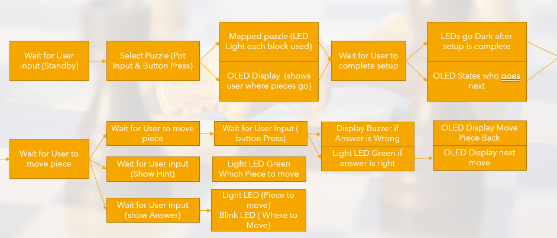

# Puzzle Me Chess

## Description

In chess there are many different ways to play the game. After each player moves three times
there are more than 121 million different moves that can end the game. Many people need to
practice chess in order to get better and there are many ways to do this. You can play over
the internet Player Vs. Player or Player Vs. Computer which range from (400 - 3200) EIO or
you can play puzzle's in chess. Puzzle's in chess allow you to study the board in any given state
and make the next several moves. This project is dedicated to solving puzzles in the physical world.

The physical chess puzzle allows the user to practice looking at a physical board to solve each puzzle.
This project is titled \Puzzle me Chess" and it will be equipped to have 3 different puzzles. The
chess board will allow the user to place piece's in the correct location that will be displayed on the
OLED screen. After each piece is on the board the chess puzzle will then display to the user which
color he/she will play to solve the puzzle. After the user makes his or her move the board will check
to see if the move was correct. If not, the user will be asked to reset the piece and try again until
puzzle is complete.

## Assumptions

* User puts correct pieces on each spot
* Chess Board will be lit evenly with light
* Each file added to the SDcard will be in a standardized format
  
## Capabilities

* LED light indicator to show user hint/show answer feature
* OLED to describe to the user where to put pieces
* Read a .csv file standardized format to quickly import puzzles
* User input switch to show user answer, indicated by LEDs
* User input Button to show user the hint
* Check board spots are correct for a given puzzle

## Limitations

* Not knowing which piece is on the correct spot
* Not being able to move the piece on the correct spot
* Not having 3+ different puzzles to choose from
* Not being able to light each square along the perimeter
* Not having multiple colors to indicate wrong or right answer
* Needing light to illuminate the chess board evenly

## Larger System Chess Idea

Create an automated chess board that could play Human Vs. Human, Human Vs. Computer, and Human Vs. Chess Puzzle.

  1. Human Vs. Human will be playable over bluetooh or in person.
  2. Human Vs. Computer will use Stockfish chess engine ELO level (400 - 2900)
  3. Human Vs. Chess Puzzle will haveover 50 Puzzles from ELO level (400 + 3000)

## Functional Block Diagram

The Puzzle me Chess project will feature a Microcontroller, one 21x21 Wooden Chess Board, 8
Multiplexers, 1 Switch, 1 Potentiometer, 1 Button, and A Display. Figure 1 shows the current
circuit layout as of 02/16/2021, this circuit doesn't show the chess board. Explanation of the
System Block Diagram to follow.

